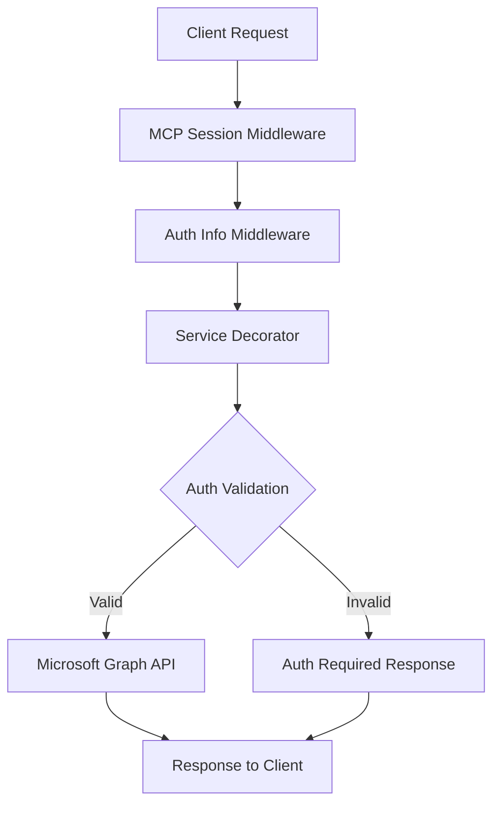

# Microsoft Teams MCP Server

<div align="center">

[](https://github.com/doto-psh/ms365-mcp/releases)
[](LICENSE)
[](https://python.org)
[](https://github.com/jlowin/fastmcp)

A powerful Model Context Protocol (MCP) server for seamless Microsoft Teams integration with enterprise-grade security and OAuth 2.1 authentication.

[Features](#features) • [Quick Start](#quick-start) • [Documentation](#documentation) • [Contributing](#contributing)

</div>

## ✨ Features

- 🔐 **Enterprise Security**: OAuth 2.1 with PKCE support and automatic session management
- 🏢 **Multi-tenant Support**: Secure user isolation and tenant-specific configurations
- 🚀 **High Performance**: Built on FastMCP framework with streamable HTTP transport
- 📊 **Comprehensive API**: Full Microsoft Graph API integration for Teams operations
- 🔄 **Auto Token Management**: Automatic token refresh and credential persistence
- 🐳 **Docker Ready**: Production-ready containerization with health checks

### Supported Operations

| Category | Operations |
|----------|------------|
| **Authentication** | OAuth flow initiation, status checking, logout |
| **Teams Management** | List teams, channels, team info, member management |
| **Chat Operations** | Direct messaging, group chats, message history |
| **Search & Discovery** | Advanced search across teams, messages, and users |
| **User Management** | Profile access, presence status, directory lookup |

## 🚀 Quick Start

### Prerequisites

- Python 3.10 or higher
- [uv](https://github.com/astral-sh/uv) package manager
- Microsoft Azure App Registration ([Setup Guide](#azure-setup))

### Installation

#### Option 1: Docker (Recommended)

```bash
# Clone the repository
git clone https://github.com/doto-psh/ms365-mcp.git
cd ms365-mcp

# Configure environment variables
cp .env.oauth21 .env
# Edit .env with your Microsoft OAuth credentials

# Start with Docker Compose
docker compose up -d

# Verify installation
curl http://localhost:8003/health
```

#### Option 2: Local Development

```bash
# Clone and setup
git clone https://github.com/doto-psh/ms365-mcp.git
cd ms365-mcp

# Create virtual environment
uv venv
source .venv/bin/activate  # On Windows: .venv\Scripts\activate

# Install dependencies
uv pip install -e .

# Configure environment
cp .env.oauth21 .env
# Edit .env with your credentials

# Start the server
uv run main.py --transport streamable-http --port 8003
```

### Azure Setup

1. **Register Application**:
   - Go to [Azure Portal](https://portal.azure.com) → App Registrations
   - Create new registration with redirect URI: `http://localhost:8003/callback`

2. **Configure API Permissions**:
   ```
   Microsoft Graph (Delegated):
   ├── User.Read
   ├── Team.ReadBasic.All
   ├── Channel.ReadBasic.All
   ├── ChannelMessage.Read.All
   ├── Chat.Read
   └── TeamMember.Read.All
   ```

3. **Update Configuration**:
   ```bash
   # .env file
   MICROSOFT_OAUTH_CLIENT_ID="your-application-id"
   MICROSOFT_OAUTH_CLIENT_SECRET="your-client-secret"
   MICROSOFT_TENANT_ID="common"  # or specific tenant ID
   ```

## 📖 Usage

### Authentication Flow

```bash
# 1. Start authentication
curl -X POST http://localhost:8003/mcp \
  -H "Content-Type: application/json" \
  -d '{
    "jsonrpc": "2.0",
    "method": "tools/call",
    "params": {
      "name": "start_teams_auth",
      "arguments": {"user_email": "user@example.com"}
    },
    "id": 1
  }'

# 2. Follow the OAuth URL from response
# 3. Use other tools after authentication
```

### Available Tools

<details>
<summary><strong>Authentication Tools</strong></summary>

- `start_teams_auth(user_email)` - Initiate OAuth flow
- `logout_teams_auth(user_email)` - Clear user session
- `check_teams_auth_status(user_email)` - Check authentication status

</details>

<details>
<summary><strong>Teams Management</strong></summary>

- `list_teams(user_email)` - List user's Teams
- `list_channels(user_email, team_id)` - List team channels
- `get_team_info(user_email, team_id)` - Get team details
- `list_team_members(user_email, team_id)` - List team members

</details>

<details>
<summary><strong>Chat Operations</strong></summary>

- `list_chats(user_email)` - List user's chats
- `get_chat_messages(user_email, chat_id)` - Get chat messages
- `send_message(user_email, chat_id, message)` - Send message

</details>

## 🏗️ Architecture

### Security Model



### Key Components

- **OAuth21SessionStore**: Multi-user session management with immutable bindings
- **Service Decorators**: Automatic authentication and authorization
- **Graph Service**: Optimized Microsoft Graph API client
- **Transport Layer**: Support for both HTTP and stdio protocols

## 🔧 Configuration

### Environment Variables

```bash
# Required: Microsoft OAuth Configuration
MICROSOFT_OAUTH_CLIENT_ID="your-client-id"
MICROSOFT_OAUTH_CLIENT_SECRET="your-client-secret"
MICROSOFT_TENANT_ID="common"

# Server Configuration
TEAMS_MCP_BASE_URI="http://localhost"
TEAMS_MCP_PORT=8003
MICROSOFT_OAUTH_REDIRECT_URI="http://localhost:8003/callback"

# OAuth 2.1 Settings
MCP_ENABLE_OAUTH21=true
OAUTH2_ALLOW_INSECURE_TRANSPORT=false  # Set true for local dev

# Optional: Advanced Settings
LOG_LEVEL=INFO
MCP_SINGLE_USER_MODE=false
```

### Docker Configuration

```yaml
# docker-compose.yml
services:
  teams-mcp-server:
    build: .
    ports:
      - "8003:8003"
    environment:
      - MICROSOFT_OAUTH_CLIENT_ID=${MICROSOFT_OAUTH_CLIENT_ID}
      - MICROSOFT_OAUTH_CLIENT_SECRET=${MICROSOFT_OAUTH_CLIENT_SECRET}
      - MICROSOFT_TENANT_ID=${MICROSOFT_TENANT_ID:-common}
      - MCP_ENABLE_OAUTH21=true
    volumes:
      - teams_mcp_credentials:/app/.microsoft_teams_mcp/credentials
    healthcheck:
      test: ["CMD", "curl", "-f", "http://localhost:8003/health"]
      interval: 30s
      timeout: 10s
      retries: 3
```

## 🔍 Troubleshooting

### Common Issues

<details>
<summary><strong>Authentication Failures</strong></summary>

**Problem**: OAuth authentication fails
```bash
# Check configuration
curl http://localhost:8003/health

# Verify Azure app permissions
# Ensure redirect URI matches exactly
# Check tenant ID configuration
```

**Solution**: 
- Verify all environment variables are set correctly
- Check Azure app registration permissions
- Ensure redirect URI matches: `http://localhost:8003/callback`

</details>

<details>
<summary><strong>Token Expiration</strong></summary>

**Problem**: "Token expired" errors
```bash
# Check token status
curl -X POST http://localhost:8003/mcp \
  -d '{"jsonrpc":"2.0","method":"tools/call","params":{"name":"check_teams_auth_status","arguments":{"user_email":"user@example.com"}},"id":1}'
```

**Solution**: Tokens are automatically refreshed. If refresh fails, re-authenticate using `start_teams_auth`.

</details>

<details>
<summary><strong>Permission Denied</strong></summary>

**Problem**: "Access denied" when calling tools

**Solution**:
- Verify Microsoft Graph API permissions in Azure
- Check user has access to requested Teams/chats
- Ensure proper admin consent for organization-wide permissions

</details>

### Debug Mode

```bash
# Enable debug logging
LOG_LEVEL=DEBUG uv run main.py --transport streamable-http

# Check logs
tail -f teams_mcp_server_debug.log
```

## 🤝 Contributing

We welcome contributions! Please see our [Contributing Guidelines](CONTRIBUTING.md) for details.

### Development Setup

```bash
# Clone and setup development environment
git clone https://github.com/doto-psh/ms365-mcp.git
cd ms365-mcp

# Install with development dependencies
uv pip install -e ".[dev]"

# Run tests
pytest

# Code formatting
black .
isort .

# Type checking
mypy .
```

### Project Structure

```
ms365-mcp/
├── auth/                   # Authentication & OAuth management
├── core/                   # Core MCP server components  
├── teams/                  # Teams-specific tools & operations
├── main.py                 # Server entry point
├── docker-compose.yaml     # Docker configuration
└── tests/                  # Test suite
```

## 📄 License

This project is licensed under the MIT License - see the [LICENSE](LICENSE) file for details.

## 🙏 Acknowledgments

- [FastMCP](https://github.com/jlowin/fastmcp) - Modern MCP framework
- [Microsoft Graph API](https://docs.microsoft.com/en-us/graph/) - Official Microsoft API
- [Model Context Protocol](https://github.com/modelcontextprotocol) - Protocol specification

## 📞 Support

- 📖 [Documentation](docs/)
- 🐛 [Issue Tracker](https://github.com/doto-psh/ms365-mcp/issues)
- 💬 [Discussions](https://github.com/doto-psh/ms365-mcp/discussions)

---

<div align="center">

**[⬆ Back to Top](#microsoft-teams-mcp-server)**

Made with ❤️ by the Microsoft Teams MCP community

</div>
