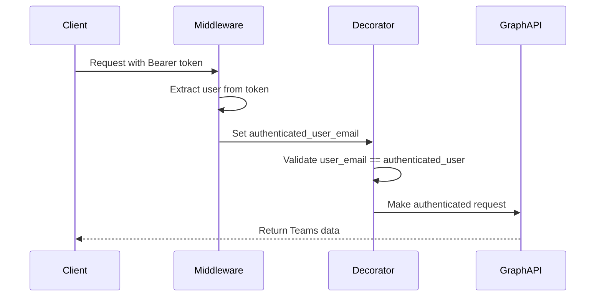

# Microsoft Teams MCP Server

A Model Context Protocol (MCP) server for Microsoft Teams integration, adapted from Google Workspace MCP architecture.

## Features

- **OAuth 2.1 Authentication** with PKCE support
- **Automatic Session Management** using context variables
- **Microsoft Graph API Integration** for Teams data access
- **Multi-tenant Support** with secure user isolation
- **FastMCP Framework** for streamable HTTP transport

## Supported Operations

### Teams Management
- `list_teams` - List user's Microsoft Teams
- `list_team_channels` - List channels in a specific team
- `get_team_info` - Get detailed team information
- `start_teams_auth` - Initiate OAuth authentication

## Quick Start

### Prerequisites

- Python 3.9 or higher
- Microsoft Azure App Registration with Teams API permissions
- uv package manager

### Installation

1. **Clone and setup the project:**
   ```bash
   cd teams-mcp-server-python
   uv venv
   source .venv/bin/activate  # On Windows: .venv\Scripts\activate
   uv pip install -e .
   ```

2. **Configure environment variables:**
   ```bash
   cp .env.oauth21 .env
   # Edit .env with your Microsoft OAuth credentials
   ```

3. **Set up Microsoft Azure App:**
   - Go to [Azure Portal](https://portal.azure.com)
   - Register a new application
   - Add Microsoft Graph API permissions:
     - `Team.ReadBasic.All`
     - `Channel.ReadBasic.All`
     - `ChannelMessage.Read.All`
     - `Chat.Read`
     - `User.Read`
   - Set redirect URI: `http://localhost:8000/oauth2callback`

### Configuration

Edit `.env` file:

```bash
# Microsoft OAuth Credentials
MICROSOFT_OAUTH_CLIENT_ID="your-application-id"
MICROSOFT_OAUTH_CLIENT_SECRET="your-client-secret"
MICROSOFT_TENANT_ID="common"  # or your specific tenant ID

# OAuth 2.1 Settings
MCP_ENABLE_OAUTH21=true

# Server Configuration
TEAMS_MCP_PORT=8000
```

### Usage

1. **Start the server:**
   ```bash
   # Streamable HTTP transport (recommended)
   uv run main.py --transport streamable-http --port 8000
   
   # Or stdio transport
   uv run main.py --transport stdio
   ```

2. **Authenticate:**
   - Call `start_teams_auth` tool with your email
   - Follow the OAuth flow in your browser
   - Return to use other tools

3. **Use Teams tools:**
   ```python
   # All tools require user_email parameter
   list_teams(user_email="user@example.com")
   list_team_channels(user_email="user@example.com", team_id="team-id")
   ```

## Architecture

### Authentication Flow



### Key Components

- **AuthInfoMiddleware**: Extracts user info from Bearer tokens
- **Service Decorator**: Automatic authentication and authorization
- **OAuth21SessionStore**: Manages user sessions and tokens
- **TeamsGraphService**: Microsoft Graph API client

## Development

### Setup Development Environment

```bash
# Install with development dependencies
uv pip install -e ".[dev]"

# Run tests
pytest

# Code formatting
black .
isort .

# Type checking
mypy .
```

### Project Structure

```
teams-mcp-server-python/
├── auth/                   # Authentication components
│   ├── oauth_config.py    # OAuth configuration
│   ├── service_decorator_teams.py  # Service decorators
│   ├── oauth21_session_store.py    # Session management
│   └── scopes.py          # Microsoft Graph scopes
├── core/                  # Core MCP server components
│   ├── server.py          # FastMCP server setup
│   └── config.py          # Server configuration
├── teams/                 # Teams-specific tools
│   └── teams_tools.py     # Teams MCP tools
├── main.py               # Server entry point
└── pyproject.toml        # Project configuration
```

## Security

- **OAuth 2.1 with PKCE**: Enhanced security for public clients
- **Token Validation**: Bearer tokens verified against Microsoft Graph
- **User Isolation**: Each user can only access their own data
- **Session Binding**: Immutable session-to-user mapping
- **Scope Validation**: Granular permission checking

## Troubleshooting

### Common Issues

1. **Authentication Errors**:
   - Verify Microsoft OAuth credentials in `.env`
   - Check Azure App permissions and consent
   - Ensure redirect URI matches configuration

2. **Token Expired**:
   - Tokens are automatically refreshed
   - Re-authenticate if refresh fails

3. **Permission Denied**:
   - Check Microsoft Graph API permissions
   - Verify user has access to requested Teams

### Logging

Enable debug logging:
```bash
LOG_LEVEL=DEBUG python main.py
```

Logs are written to `teams_mcp_server_debug.log`.

## License

MIT License - see LICENSE file for details.

## Contributing

1. Fork the repository
2. Create a feature branch
3. Make your changes
4. Add tests
5. Submit a pull request
