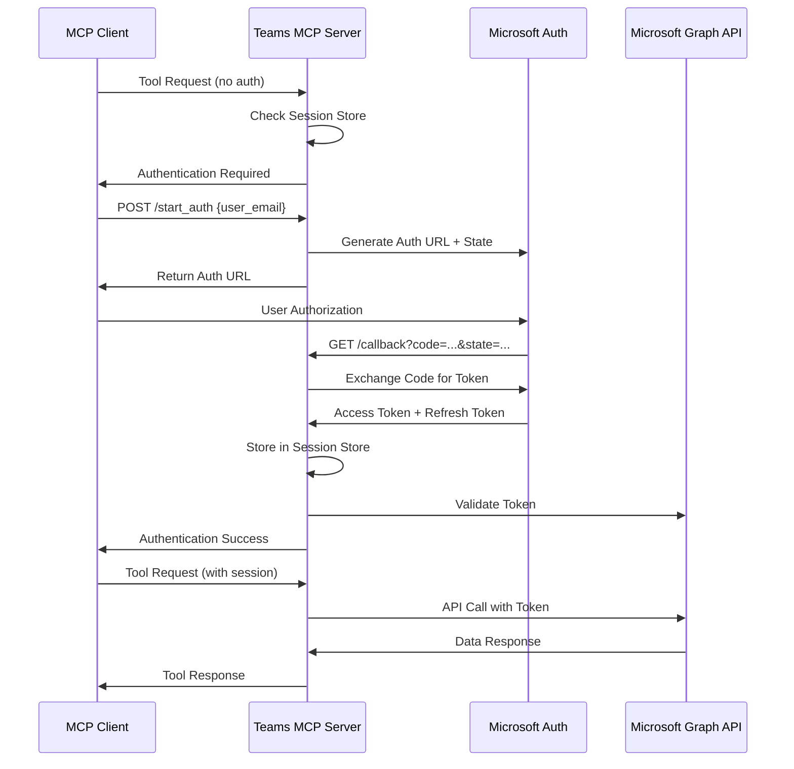

# Microsoft Teams MCP Server - Complete Architecture Analysis

## 1. Overview

The Microsoft Teams MCP Server is a server that integrates Microsoft Teams with Microsoft Graph API through the Model Context Protocol (MCP). This server provides a security architecture based on OAuth 2.1 for user authentication, session management, and Teams API access.

## 2. Overall Architecture

### 2.1 Core Components

```
┌─────────────────────────────────────────────────────────────┐
│                   Microsoft Teams MCP Server                │
├─────────────────────────────────────────────────────────────┤
│  main.py (Entry Point)                                     │
├─────────────────────────────────────────────────────────────┤
│  Core Components:                                           │
│  ├── core/server.py (FastMCP Server + Custom Routes)       │
│  ├── core/config.py (Configuration Management)             │
│  ├── core/context.py (Session Context Management)          │
│  └── core/utils.py (Utility Functions)                     │
├─────────────────────────────────────────────────────────────┤
│  Authentication & Authorization:                            │
│  ├── auth/teams_auth.py (Microsoft OAuth Handler)          │
│  ├── auth/oauth21_session_store.py (Session Store)         │
│  ├── auth/oauth_config.py (OAuth Configuration)            │
│  ├── auth/scopes.py (Microsoft Graph Scopes)               │
│  ├── auth/mcp_session_middleware.py (Session Middleware)    │
│  ├── auth/oauth_callback_server.py (OAuth Callback)        │
│  └── auth/service_decorator_teams.py (Service Decorator)    │
├─────────────────────────────────────────────────────────────┤
│  Teams API Tools:                                           │
│  ├── teams/teams_tools.py (Teams Management)               │
│  ├── teams/chat_tools.py (Chat Operations)                 │
│  ├── teams/search_tools.py (Search Functionality)          │
│  └── teams/users_tools.py (User Management)                │
└─────────────────────────────────────────────────────────────┘
```

## 3. Authentication System Analysis

### 3.1 OAuth 2.1 Based Authentication Flow

The Microsoft Teams MCP Server uses **OAuth 2.1** to authenticate with the Microsoft Graph API.

#### Authentication Flow:



### 3.2 Session Management System

#### OAuth21SessionStore Class:
- **Multi-user Session Management**: Stores each user's OAuth tokens separately
- **Session Binding**: Binds MCP session IDs to user emails for enhanced security
- **Immutable Binding**: Once bound, sessions cannot be changed to different users (security)

```python
# Session Storage Structure
{
    "user_email": {
        "access_token": "...",
        "refresh_token": "...", 
        "expiry": datetime,
        "session_id": "oauth_session_id",
        "mcp_session_id": "fastmcp_session_id"
    }
}

# Session Binding (Security Layer)
{
    "mcp_session_id": "user_email",  # Immutable binding
    "oauth_session_id": "user_email"
}
```

### 3.3 Authentication Security Validation

The server performs three-tier security validation:

1. **JWT Token Validation** (highest priority): Extract email from Bearer token in request headers
2. **Session Binding Validation**: Check if session ID is bound to a specific user
3. **MCP Session Mapping**: Verify FastMCP session to user mapping

```python
def get_credentials_with_validation(
    requested_user_email: str,
    session_id: Optional[str] = None,
    auth_token_email: Optional[str] = None
) -> Optional[MicrosoftCredentials]:
    # 1. JWT Token Validation (highest priority)
    if auth_token_email:
        if auth_token_email != requested_user_email:
            # Security violation: Attempt to access different user's credentials
            return None
    
    # 2. Session Binding Validation
    if session_id:
        bound_user = self._session_auth_binding.get(session_id)
        if bound_user and bound_user != requested_user_email:
            # Security violation: Bound session attempting to access different user
            return None
```

## 4. Transport Mode Analysis

### 4.1 Streamable-HTTP Mode

**Features:**
- Operates as FastAPI-based HTTP server
- Built-in CORS middleware for browser support
- Provides RESTful API endpoints
- Applies session middleware stack

**Key Endpoints:**
- `GET /health`: Server status check
- `GET /callback`: OAuth callback handling
- `POST /start_auth`: Authentication flow initiation
- `POST /mcp/*`: MCP tool calls

**Middleware Stack:**
```python
# 1. MCPSessionMiddleware (session extraction and context setting)
# 2. AuthInfoMiddleware (authentication info injection)
# 3. CORSMiddleware (CORS handling - built into FastMCP)
```

### 4.2 STDIO Mode

**Features:**
- MCP communication through standard input/output
- Separate OAuth callback server (port 8000)
- Primarily used in terminal/console environments

## 5. Session Persistence Analysis

### 5.1 Token Expiration Management

**Access Token:**
- Default expiration: **1 hour** (Microsoft Graph API default)
- Auto-refresh: Supports automatic renewal using Refresh Token

**Refresh Token:**
- Expiration: **90 days** (Microsoft default)
- Conditional renewal: New Refresh Token may be issued upon use

**Session Persistence:**
```python
@property
def expired(self):
    """Check token expiration"""
    if not self.expiry:
        return True
    return datetime.now() >= self.expiry

def refresh(self, request=None):
    """Token renewal using Refresh Token"""
    app = msal.ConfidentialClientApplication(
        client_id=self.client_id,
        client_credential=self.client_secret,
        authority=f"{MICROSOFT_AUTHORITY}{self.tenant_id}"
    )
    
    result = app.acquire_token_by_refresh_token(
        refresh_token=self.refresh_token,
        scopes=self.scopes
    )
```

### 5.2 Persistent Storage

**Credential Storage:**
- Location: `~/.microsoft_teams_mcp/credentials/`
- Format: JSON files
- Docker Volume: Persistent storage via `teams_mcp_credentials` volume

## 6. Microsoft Graph API Scopes

### 6.1 Scope Definitions

```python
# Basic user information
USER_READ_SCOPE = 'https://graph.microsoft.com/User.Read'

# Teams-related permissions
TEAMS_READ_SCOPE = 'https://graph.microsoft.com/Team.ReadBasic.All'
TEAMS_CHANNELS_READ_SCOPE = 'https://graph.microsoft.com/Channel.ReadBasic.All' 
TEAMS_MESSAGES_READ_SCOPE = 'https://graph.microsoft.com/ChannelMessage.Read.All'
TEAMS_CHAT_READ_SCOPE = 'https://graph.microsoft.com/Chat.Read'
TEAMS_MEMBERS_READ_SCOPE = 'https://graph.microsoft.com/TeamMember.Read.All'
```

### 6.2 Dynamic Scope Management

Request only necessary permissions based on enabled tools:

```python
TOOL_SCOPES_MAP = {
    'teams': TEAMS_SCOPES,
    'user': [USER_READ_SCOPE, USER_READ_ALL_SCOPE]
}

def get_current_scopes():
    """Return permissions for currently enabled tools"""
    enabled_tools = _ENABLED_TOOLS or ['teams']
    scopes = BASE_SCOPES.copy()
    
    for tool in enabled_tools:
        if tool in TOOL_SCOPES_MAP:
            scopes.extend(TOOL_SCOPES_MAP[tool])
    
    return list(set(scopes))  # Remove duplicates
```

## 7. Tool System Analysis

### 7.1 Service Decorator Pattern

All Teams API tools use the `@require_teams_service` decorator:

```python
@server.tool()
@require_teams_service("teams", "teams_read")
async def list_teams(service, user_email: str) -> str:
    """List Teams"""
    teams_data = await service.get("/me/joinedTeams")
    return json.dumps(teams_data)
```

**Decorator Functions:**
1. **Authentication Check**: Verify user's valid token
2. **Permission Validation**: Check required Microsoft Graph API permissions
3. **Service Injection**: Inject authenticated `TeamsGraphService` object
4. **Error Handling**: Return appropriate error messages on authentication failure

### 7.2 TeamsGraphService Class

HTTP client for Microsoft Graph API calls:

```python
class TeamsGraphService:
    def __init__(self, access_token: str):
        self.access_token = access_token
        self.base_url = "https://graph.microsoft.com/v1.0"
        self.headers = {
            "Authorization": f"Bearer {access_token}",
            "Content-Type": "application/json"
        }
    
    async def get(self, endpoint: str) -> Dict[str, Any]:
        """GET request"""
        async with httpx.AsyncClient() as client:
            response = await client.get(f"{self.base_url}{endpoint}", headers=self.headers)
            response.raise_for_status()
            return response.json()
```

## 8. Actual Tool Features

### 8.1 Teams Management Tools

- `list_teams()`: List of Teams user belongs to
- `list_channels()`: Channel list for specific Team
- `get_team_info()`: Detailed Team information
- `list_team_members()`: Team member list

### 8.2 Chat Tools

- `list_chats()`: User's chat list
- `get_chat_messages()`: Messages from specific chat
- `send_message()`: Send message

### 8.3 Search Tools

- `search_messages()`: Message search
- `search_teams()`: Teams search
- `search_users()`: User search

### 8.4 User Management Tools

- `get_user_profile()`: User profile lookup
- `list_users()`: Organization user list
- `get_user_presence()`: User current status

## 9. Security Features

### 9.1 Multi-layer Security

1. **OAuth 2.1 Standard Compliance**: Latest OAuth security standards applied
2. **PKCE Support**: Prevents man-in-the-middle attacks through Code Challenge
3. **Session Binding**: Prevents session hijacking
4. **Token Validation**: JWT token-based user authentication
5. **Permission Separation**: User-specific credential isolation

### 9.2 Single-User Mode

Simplified authentication mode for development environments:

```python
def _find_any_credentials(base_dir: str) -> Optional[TeamsCredentials]:
    """Use any valid credentials in single-user mode"""
    # Load first valid credential file from credentials directory
    for filename in os.listdir(base_dir):
        if filename.endswith(".json"):
            # Load and return credentials
            pass
```

## 10. Environment Configuration

### 10.1 Required Environment Variables

```bash
# Microsoft OAuth Settings
MICROSOFT_OAUTH_CLIENT_ID=your_client_id
MICROSOFT_OAUTH_CLIENT_SECRET=your_client_secret  
MICROSOFT_TENANT_ID=common  # or specific tenant ID

# Server Settings
TEAMS_MCP_BASE_URI=http://localhost
TEAMS_MCP_PORT=8003
MICROSOFT_OAUTH_REDIRECT_URI=http://localhost:8003/callback

# OAuth 2.1 Activation
MCP_ENABLE_OAUTH21=true
```

### 10.2 Docker Deployment

```yaml
services:
  teams-mcp-server:
    build: .
    ports:
      - "8003:8003"
    volumes:
      - teams_mcp_credentials:/app/.microsoft_teams_mcp/credentials
    environment:
      - MCP_ENABLE_OAUTH21=true
      # ... other environment variables
```

## 11. Scalability and Maintainability

### 11.1 Modular Design

- **Authentication Module**: Independent OAuth handling
- **Tool Modules**: Separate files for each functionality
- **Core Modules**: Centralized common functionality
- **Configuration Module**: Environment-specific configuration management

### 11.2 Logging and Monitoring

```python
# Detailed logging configuration
file_handler = logging.FileHandler('teams_mcp_server_debug.log')
file_formatter = logging.Formatter(
    '%(asctime)s - %(name)s - %(levelname)s - %(process)d - %(threadName)s '
    '[%(module)s.%(funcName)s:%(lineno)d] - %(message)s'
)
```

**Health Check Endpoint:**
```python
@server.custom_route("/health", methods=["GET"])
async def health_check(request: Request):
    return JSONResponse({
        "status": "healthy",
        "service": "teams-mcp-server", 
        "version": version,
        "transport": get_transport_mode()
    })
```

## 12. Performance and Optimization

### 12.1 Asynchronous Processing

- **async/await**: Applied asynchronous processing to all I/O operations
- **httpx.AsyncClient**: Uses asynchronous HTTP client
- **FastAPI**: Based on asynchronous web framework

### 12.2 Token Caching

- **Memory Caching**: Cache valid tokens in memory
- **Auto Refresh**: Automatic token renewal before expiration
- **Persistent Storage**: Maintain sessions even after restart

## 13. Conclusion

The Microsoft Teams MCP Server provides secure and scalable Microsoft Teams integration through a robust OAuth 2.1-based authentication system and multi-user session management.

**Key Strengths:**
- **Security**: Multi-layer security validation
- **Scalability**: Modular architecture
- **Flexibility**: Support for multiple transport modes
- **Reliability**: Automatic token renewal and error handling

This architecture provides a foundation for safely utilizing Microsoft Teams API in enterprise environments and has an extensible structure for future integration with additional Microsoft 365 services.
