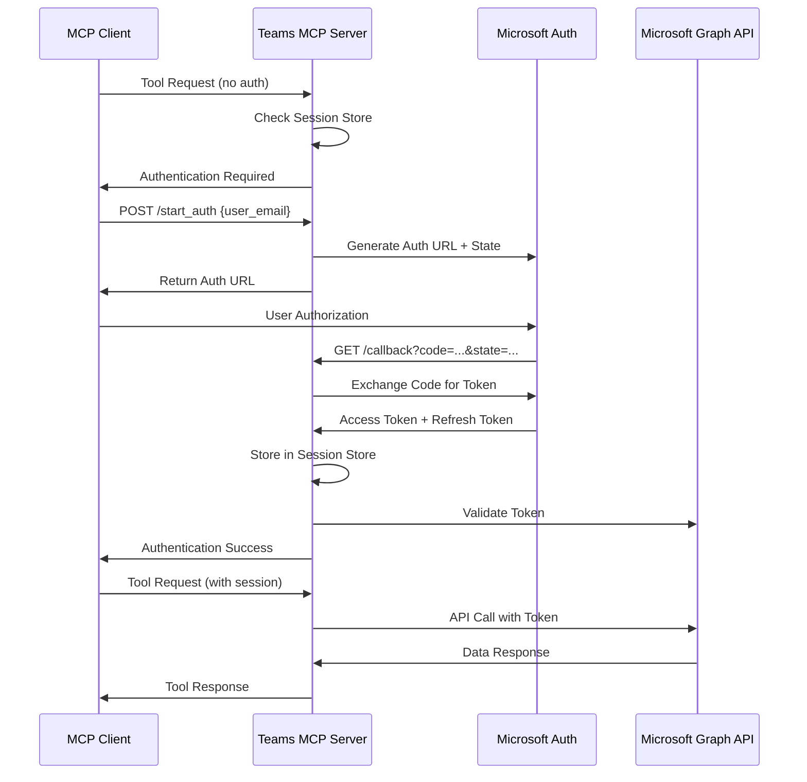

# Microsoft Teams MCP Server 전체 아키텍처 분석

## 1. 개요

Microsoft Teams MCP Server는 Model Context Protocol(MCP)를 통해 Microsoft Teams와 Microsoft Graph API를 연동하는 서버입니다. 이 서버는 사용자 인증, 세션 관리, 그리고 Teams API 접근을 위한 OAuth 2.1 기반의 보안 아키텍처를 제공합니다.

## 2. 전체 아키텍처

### 2.1 핵심 컴포넌트

```
┌─────────────────────────────────────────────────────────────┐
│                   Microsoft Teams MCP Server                │
├─────────────────────────────────────────────────────────────┤
│  main.py (Entry Point)                                     │
├─────────────────────────────────────────────────────────────┤
│  Core Components:                                           │
│  ├── core/server.py (FastMCP Server + Custom Routes)       │
│  ├── core/config.py (Configuration Management)             │
│  ├── core/context.py (Session Context Management)          │
│  └── core/utils.py (Utility Functions)                     │
├─────────────────────────────────────────────────────────────┤
│  Authentication & Authorization:                            │
│  ├── auth/teams_auth.py (Microsoft OAuth Handler)          │
│  ├── auth/oauth21_session_store.py (Session Store)         │
│  ├── auth/oauth_config.py (OAuth Configuration)            │
│  ├── auth/scopes.py (Microsoft Graph Scopes)               │
│  ├── auth/mcp_session_middleware.py (Session Middleware)    │
│  ├── auth/oauth_callback_server.py (OAuth Callback)        │
│  └── auth/service_decorator_teams.py (Service Decorator)    │
├─────────────────────────────────────────────────────────────┤
│  Teams API Tools:                                           │
│  ├── teams/teams_tools.py (Teams Management)               │
│  ├── teams/chat_tools.py (Chat Operations)                 │
│  ├── teams/search_tools.py (Search Functionality)          │
│  └── teams/users_tools.py (User Management)                │
└─────────────────────────────────────────────────────────────┘
```

## 3. 인증 시스템 분석

### 3.1 OAuth 2.1 기반 인증 흐름

Microsoft Teams MCP Server는 **OAuth 2.1**을 사용하여 Microsoft Graph API에 인증합니다.

#### 인증 흐름:



### 3.2 세션 관리 시스템

#### OAuth21SessionStore 클래스:
- **다중 사용자 세션 관리**: 각 사용자의 OAuth 토큰을 별도로 저장
- **세션 바인딩**: MCP 세션 ID와 사용자 이메일을 바인딩하여 보안 강화
- **불변 바인딩**: 한 번 바인딩된 세션은 다른 사용자로 변경 불가 (보안)

```python
# 세션 저장 구조
{
    "user_email": {
        "access_token": "...",
        "refresh_token": "...", 
        "expiry": datetime,
        "session_id": "oauth_session_id",
        "mcp_session_id": "fastmcp_session_id"
    }
}

# 세션 바인딩 (보안 계층)
{
    "mcp_session_id": "user_email",  # 불변 바인딩
    "oauth_session_id": "user_email"
}
```

### 3.3 인증 보안 검증

서버는 3단계 보안 검증을 수행합니다:

1. **JWT 토큰 검증** (최우선): 요청 헤더의 Bearer 토큰에서 이메일 추출
2. **세션 바인딩 검증**: 세션 ID가 특정 사용자에게 바인딩되어 있는지 확인
3. **MCP 세션 매핑**: FastMCP 세션과 사용자 매핑 확인

```python
def get_credentials_with_validation(
    requested_user_email: str,
    session_id: Optional[str] = None,
    auth_token_email: Optional[str] = None
) -> Optional[MicrosoftCredentials]:
    # 1. JWT 토큰 검증 (최고 우선순위)
    if auth_token_email:
        if auth_token_email != requested_user_email:
            # 보안 위반: 다른 사용자 크리덴셜 접근 시도
            return None
    
    # 2. 세션 바인딩 검증
    if session_id:
        bound_user = self._session_auth_binding.get(session_id)
        if bound_user and bound_user != requested_user_email:
            # 보안 위반: 바인딩된 세션이 다른 사용자 접근 시도
            return None
```

## 4. Transport 모드 분석

### 4.1 Streamable-HTTP 모드

**특징:**
- FastAPI 기반 HTTP 서버로 동작
- CORS 미들웨어 내장으로 브라우저 지원
- RESTful API 엔드포인트 제공
- 세션 미들웨어 스택 적용

**주요 엔드포인트:**
- `GET /health`: 서버 상태 확인
- `GET /callback`: OAuth 콜백 처리
- `POST /start_auth`: 인증 흐름 시작
- `POST /mcp/*`: MCP 도구 호출

**미들웨어 스택:**
```python
# 1. MCPSessionMiddleware (세션 추출 및 컨텍스트 설정)
# 2. AuthInfoMiddleware (인증 정보 주입)
# 3. CORSMiddleware (CORS 처리 - FastMCP 내장)
```

### 4.2 STDIO 모드

**특징:**
- 표준 입출력을 통한 MCP 통신
- 별도 OAuth 콜백 서버 실행 (포트 8000)
- 터미널/콘솔 환경에서 주로 사용

## 5. 세션 지속성 분석

### 5.1 토큰 만료 관리

**Access Token:**
- 기본 만료 시간: **1시간** (Microsoft Graph API 기본값)
- 자동 갱신: Refresh Token을 사용한 자동 갱신 지원

**Refresh Token:**
- 만료 시간: **90일** (Microsoft 기본값)
- 조건부 갱신: 사용 시마다 새로운 Refresh Token 발급 가능

**세션 지속성:**
```python
@property
def expired(self):
    """토큰 만료 확인"""
    if not self.expiry:
        return True
    return datetime.now() >= self.expiry

def refresh(self, request=None):
    """Refresh Token을 사용한 토큰 갱신"""
    app = msal.ConfidentialClientApplication(
        client_id=self.client_id,
        client_credential=self.client_secret,
        authority=f"{MICROSOFT_AUTHORITY}{self.tenant_id}"
    )
    
    result = app.acquire_token_by_refresh_token(
        refresh_token=self.refresh_token,
        scopes=self.scopes
    )
```

### 5.2 영구 저장소

**크리덴셜 저장:**
- 위치: `~/.microsoft_teams_mcp/credentials/`
- 형식: JSON 파일
- Docker 볼륨: `teams_mcp_credentials` 볼륨으로 영구 저장

## 6. Microsoft Graph API Scopes

### 6.1 범위 정의

```python
# 기본 사용자 정보
USER_READ_SCOPE = 'https://graph.microsoft.com/User.Read'

# Teams 관련 권한
TEAMS_READ_SCOPE = 'https://graph.microsoft.com/Team.ReadBasic.All'
TEAMS_CHANNELS_READ_SCOPE = 'https://graph.microsoft.com/Channel.ReadBasic.All' 
TEAMS_MESSAGES_READ_SCOPE = 'https://graph.microsoft.com/ChannelMessage.Read.All'
TEAMS_CHAT_READ_SCOPE = 'https://graph.microsoft.com/Chat.Read'
TEAMS_MEMBERS_READ_SCOPE = 'https://graph.microsoft.com/TeamMember.Read.All'
```

### 6.2 동적 Scope 관리

활성화된 도구에 따라 필요한 권한만 요청:

```python
TOOL_SCOPES_MAP = {
    'teams': TEAMS_SCOPES,
    'user': [USER_READ_SCOPE, USER_READ_ALL_SCOPE]
}

def get_current_scopes():
    """현재 활성화된 도구의 권한 반환"""
    enabled_tools = _ENABLED_TOOLS or ['teams']
    scopes = BASE_SCOPES.copy()
    
    for tool in enabled_tools:
        if tool in TOOL_SCOPES_MAP:
            scopes.extend(TOOL_SCOPES_MAP[tool])
    
    return list(set(scopes))  # 중복 제거
```

## 7. 도구 시스템 분석

### 7.1 Service Decorator 패턴

모든 Teams API 도구는 `@require_teams_service` 데코레이터를 사용:

```python
@server.tool()
@require_teams_service("teams", "teams_read")
async def list_teams(service, user_email: str) -> str:
    """Teams 목록 조회"""
    teams_data = await service.get("/me/joinedTeams")
    return json.dumps(teams_data)
```

**데코레이터 기능:**
1. **인증 확인**: 사용자의 유효한 토큰 확인
2. **권한 검증**: 필요한 Microsoft Graph API 권한 확인
3. **서비스 주입**: 인증된 `TeamsGraphService` 객체 주입
4. **에러 처리**: 인증 실패 시 적절한 오류 메시지 반환

### 7.2 TeamsGraphService 클래스

Microsoft Graph API 호출을 위한 HTTP 클라이언트:

```python
class TeamsGraphService:
    def __init__(self, access_token: str):
        self.access_token = access_token
        self.base_url = "https://graph.microsoft.com/v1.0"
        self.headers = {
            "Authorization": f"Bearer {access_token}",
            "Content-Type": "application/json"
        }
    
    async def get(self, endpoint: str) -> Dict[str, Any]:
        """GET 요청"""
        async with httpx.AsyncClient() as client:
            response = await client.get(f"{self.base_url}{endpoint}", headers=self.headers)
            response.raise_for_status()
            return response.json()
```

## 8. 실제 도구 기능

### 8.1 Teams 관리 도구

- `list_teams()`: 사용자가 속한 Teams 목록
- `list_channels()`: 특정 Team의 채널 목록
- `get_team_info()`: Team 상세 정보
- `list_team_members()`: Team 멤버 목록

### 8.2 채팅 도구

- `list_chats()`: 사용자의 채팅 목록
- `get_chat_messages()`: 특정 채팅의 메시지
- `send_message()`: 메시지 전송

### 8.3 검색 도구

- `search_messages()`: 메시지 검색
- `search_teams()`: Teams 검색
- `search_users()`: 사용자 검색

### 8.4 사용자 관리 도구

- `get_user_profile()`: 사용자 프로필 조회
- `list_users()`: 조직 내 사용자 목록
- `get_user_presence()`: 사용자 현재 상태

## 9. 보안 특징

### 9.1 다중 계층 보안

1. **OAuth 2.1 표준 준수**: 최신 OAuth 보안 기준 적용
2. **PKCE 지원**: Code Challenge를 통한 중간자 공격 방지
3. **세션 바인딩**: 세션 하이재킹 방지
4. **토큰 검증**: JWT 토큰 기반 사용자 인증
5. **권한 분리**: 사용자별 크리덴셜 격리

### 9.2 Single-User 모드

개발 환경을 위한 단순화된 인증 모드:

```python
def _find_any_credentials(base_dir: str) -> Optional[TeamsCredentials]:
    """Single-user 모드에서 임의의 유효한 크리덴셜 사용"""
    # 크리덴셜 디렉토리에서 첫 번째 유효한 크리덴셜 파일 로드
    for filename in os.listdir(base_dir):
        if filename.endswith(".json"):
            # 크리덴셜 로드 및 반환
            pass
```

## 10. 환경 설정

### 10.1 필수 환경 변수

```bash
# Microsoft OAuth 설정
MICROSOFT_OAUTH_CLIENT_ID=your_client_id
MICROSOFT_OAUTH_CLIENT_SECRET=your_client_secret  
MICROSOFT_TENANT_ID=common  # 또는 특정 테넌트 ID

# 서버 설정
TEAMS_MCP_BASE_URI=http://localhost
TEAMS_MCP_PORT=8003
MICROSOFT_OAUTH_REDIRECT_URI=http://localhost:8003/callback

# OAuth 2.1 활성화
MCP_ENABLE_OAUTH21=true
```

### 10.2 Docker 배포

```yaml
services:
  teams-mcp-server:
    build: .
    ports:
      - "8003:8003"
    volumes:
      - teams_mcp_credentials:/app/.microsoft_teams_mcp/credentials
    environment:
      - MCP_ENABLE_OAUTH21=true
      # ... 기타 환경 변수
```

## 11. 확장성 및 유지보수성

### 11.1 모듈화 설계

- **인증 모듈**: 독립적인 OAuth 처리
- **도구 모듈**: 각 기능별 별도 파일
- **핵심 모듈**: 공통 기능 중앙화
- **설정 모듈**: 환경별 설정 관리

### 11.2 로깅 및 모니터링

```python
# 상세 로깅 설정
file_handler = logging.FileHandler('teams_mcp_server_debug.log')
file_formatter = logging.Formatter(
    '%(asctime)s - %(name)s - %(levelname)s - %(process)d - %(threadName)s '
    '[%(module)s.%(funcName)s:%(lineno)d] - %(message)s'
)
```

**헬스체크 엔드포인트:**
```python
@server.custom_route("/health", methods=["GET"])
async def health_check(request: Request):
    return JSONResponse({
        "status": "healthy",
        "service": "teams-mcp-server", 
        "version": version,
        "transport": get_transport_mode()
    })
```

## 12. 성능 및 최적화

### 12.1 비동기 처리

- **async/await**: 모든 I/O 작업에 비동기 처리 적용
- **httpx.AsyncClient**: 비동기 HTTP 클라이언트 사용
- **FastAPI**: 비동기 웹 프레임워크 기반

### 12.2 토큰 캐싱

- **메모리 캐싱**: 유효한 토큰을 메모리에 캐시
- **자동 갱신**: 만료 전 자동 토큰 갱신
- **영구 저장**: 재시작 시에도 세션 유지

## 13. 결론

Microsoft Teams MCP Server는 OAuth 2.1 기반의 견고한 인증 시스템과 다중 사용자 세션 관리를 통해 안전하고 확장 가능한 Microsoft Teams 통합을 제공합니다. 

**주요 강점:**
- **보안**: 다중 계층 보안 검증
- **확장성**: 모듈화된 아키텍처
- **유연성**: 다중 transport 모드 지원
- **신뢰성**: 자동 토큰 갱신 및 오류 처리

이 아키텍처는 엔터프라이즈 환경에서 안전하게 Microsoft Teams API를 활용할 수 있는 기반을 제공하며, 향후 추가 Microsoft 365 서비스 통합에도 확장 가능한 구조를 갖추고 있습니다.
